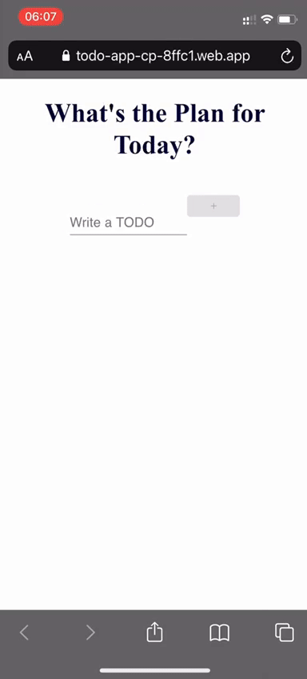

# TODO-APP





## Table of contents

- [General info](#general-info)
- [Technologies](#technologies)
- [Setup](#setup)
- [Features](#features)

## General info

This is a training project 

## Technologies

Project is created with:

- React
- HTMl/CSS
- FIREBASE
- ui-material

## Features
- Create a task
- Delete a task
- Edit a task

## Setup

To run this project, install it locally using npm:

```

```
